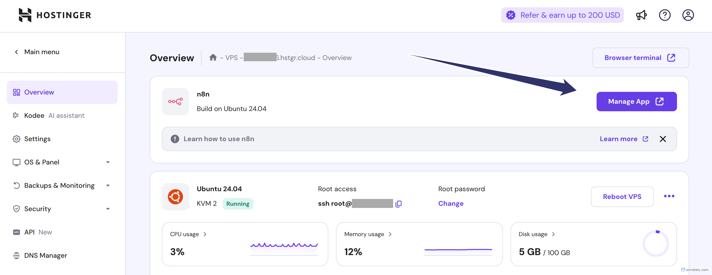

# How to Update n8n on a VPS (e.g., Hostinger) to Get the New MCP Nodes

If you're self-hosting n8n on a VPS (like Hostinger) and want to take advantage of the new **MCP nodes**, you're in luck — updating your n8n instance is quick and painless if you're using Docker.

Follow the concise guide below to upgrade your deployment and unlock the latest features.

---

## Step 1: SSH into Your VPS

Use your preferred terminal or the browser-based terminal provided by your host. For example:

```bash
ssh root@your-server-ip
```

Or using the browser console, just click this button on hostinger



---

## Step 2: Locate Your `docker-compose.yml` File

Usually, this file is in your root's home directory:

```bash
cd ~
nano docker-compose.yml
```

---

## Step 3: Update the Image Tag to "next"

In the `docker-compose.yml`, find the line with the `image` key under the n8n service:

```yaml
image: n8nio/n8n:latest
```

Change it to:

```yaml
image: n8nio/n8n:next
```

This ensures you're pulling the latest cutting-edge version, which includes the MCP nodes.

> 📌 You can browse available image tags at: [https://hub.docker.com/r/n8nio/n8n/tags](https://hub.docker.com/r/n8nio/n8n/tags)

---

## Step 4: Stop the Current Containers

Depending on your Docker Compose version, run one of the following:

```bash
docker compose down
```

_or older versions:_

```bash
docker-compose down
```

---

## Step 5: Pull the New Image

Fetch the updated `next` image:

```bash
docker compose pull
```

---

## Step 6: Start Everything Back Up

Spin up your containers again:

```bash
docker compose up -d
```

---

## You're All Set ✅

Once the containers restart, your n8n instance will be running the latest version with MCP node support. Check your browser dashboard and start building with the new tools!

If you want more content like this, consider joining the [Digital Cognition Club](https://cognition.digital) — where practitioners are building the future of AI and automation.

